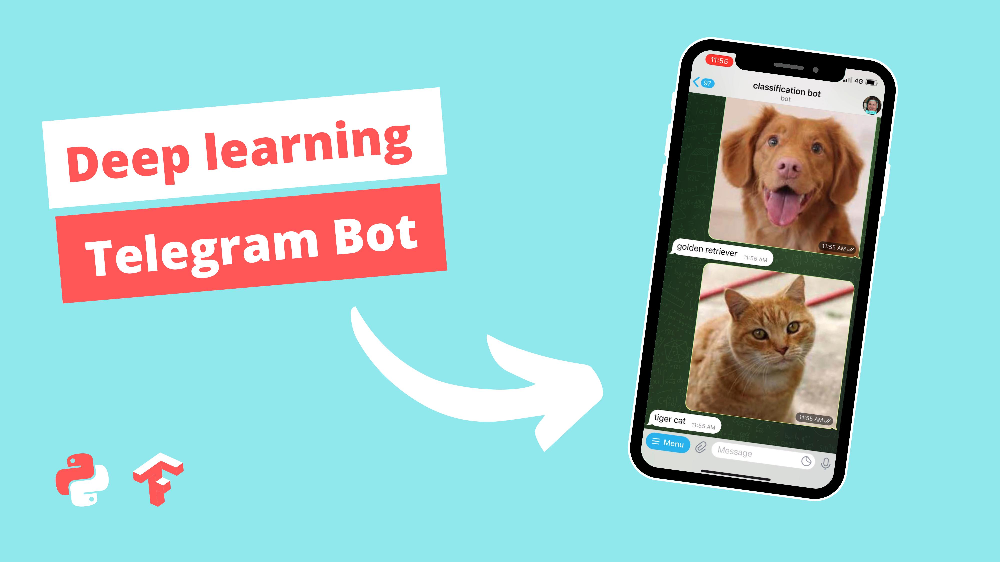

# Deep-learning-telegram-bot
<h1>Explaination Video</h1>
<a href="https://youtu.be/7OK29z1gWPo">Deep learning telegram bot</a>

<h1>Description</h1>
In this video we will learn to create a telegram bot which takes the image from user and  predicts the class of that image. This bot uses ResNet50 model for the prediction. We will create the telegram bot using python and the module which is called python-telegram-bot. 
As discussed this bot works with images and keras model/ tensorflow model takes that image as input and then bot replies which with class. 
So in this video we will learn how to, 
Command Handle  
Message Handle 
Image Handle 
all of this step by step which line by line. 

<h1>Connect with me</h1>
If you have any queries regarding any of the topic I discussed in this video feel free to talk to e using below links: 
facebook : https://m.facebook.com/proogramminghub 
instagram : @programming_hut 
twitter : https://twitter.com/programming_hut 
github : https://github.com/Pawandeep-prog 
discord : https://discord.gg/G5Cunyg 
linkedin : https://www.linkedin.com/in/programminghut 
youtube : https://www.youtube.com/c/programminghutofficial 
